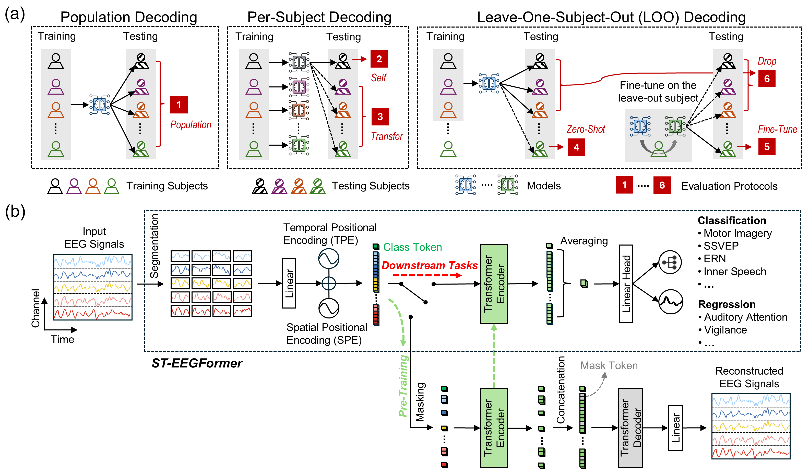

# 2. Contexte : laboratoire, BCI et attention spatiale

## 2.1 Le Ishii Laboratory

Le stage se déroule au **Ishii Laboratory** (論理生命学), Graduate School of Informatics, Kyoto University, campus Yoshida (Comprehensive Research Building No. 10). Le groupe travaille à l’interface de l’apprentissage automatique, du traitement de signaux biologiques et des neurosciences computationnelles. Dans la convention de stage, le mentorship est décrit ainsi : Ishii (apprentissage automatique), Phi (signaux biologiques), Katayama (neurosciences computationnelles). Dans la pratique quotidienne, Cuong (Phi) a cadré les objectifs de reproduction et Liz Costato a porté la ligne LaBraM sur le même dataset.

Le laboratoire s’appuie sur un **cluster GPU** (nœuds `kng*` / `gnode*`, ordonnanceur Slurm sur `mnode`). Les runs lourds de fine-tuning (fenêtre 8 s, modèle > 300 M de paramètres) n’étaient pas tenables sur CPU Mac ; ils ont été déportés sur ce cluster. Je n’ai pas d’organigramme officiel ATR/Kyoto à joindre : le journal de bord parle d’un ancrage **Kyoto / ATR** et d’un jeu **ATR NBP** (Neural Basis of Perception) pour l’attention spatiale. En l’absence d’un document institutionnel sur ce PC, je limite les affirmations à ce qui est attesté par le journal et la convention (Kyoto University, Ishii Lab).

La vie du groupe comprend un séminaire hebdomadaire et, à partir d’août 2026, un *paper reading club* croisant **foundation models EEG** et **imagerie calcique** (travaux Miyamoto / Hatsuta, papiers CalM et CAPT). Mon exposé du 19 août s’inscrit dans ce club, distinct de la soutenance ESME.

## 2.2 Interfaces cerveau–ordinateur et décodage EEG

Une interface cerveau–ordinateur (BCI) vise à inférer une intention ou un état à partir de l’activité cérébrale, ici l’**électroencéphalogramme**. Le décodage supervisé classique (CSP + LDA, réseaux convolutifs dédiés EEG, etc.) reste compétitif, surtout quand les données cibles sont peu nombreuses. Les FM EEG ajoutent une étape de pré-entraînement auto-supervisé sur de grands corpus, puis une adaptation (sonde linéaire ou fine-tuning) sur la tâche aval.

Deux difficultés structurent le stage :

- **Transfert inter-sujets.** Un décodeur entraîné sur l’ensemble de la population peut profiter d’un mélange de sujets ; un protocole *leave-one-subject-out* (LOSO) teste la généralisation à un sujet jamais vu, beaucoup plus proche d’un usage BCI réel.
- **Calibrage et prétraitement.** Avant toute architecture, le signal doit être filtré, référencé, découpé sur la bonne fenêtre d’intérêt. Une partie substantielle du stage a consisté à découvrir que le modèle n’était pas en cause lorsque les performances collaient au hasard.

## 2.3 La tâche d’attention spatiale

Le jeu utilisé in fine est un protocole d’**attention visuo-spatiale** gauche/droite, enregistré au laboratoire (données ATR NBP sur clé, ~43 sujets, archives `part0`…`part6`). D’après l’exploration de mai (MNE, sujet 003) : 68 canaux, 256 Hz, marqueurs 1 / 2 / 8 / 16, et un décompte typique de **12 essais Left + 12 Right + 24 Control** par session de tâche. La période d’attention utile retenue après alignement sur le pipeline de Liz est de **8 secondes** (2048 échantillons à 256 Hz), et non 2 s. Quatre canaux EOG sont typés à part : la référence moyenne et la sélection ViT portent sur **64 électrodes EEG**.

La tâche de classification est **binaire** (gauche vs droite). Le niveau de hasard est donc **50 %**, contrairement à BCI-IV-2a (4 classes, hasard 25 %). C’est un point de confusion fréquent : un 26 % sur BCI-IV-2a est un échec ; un 62 % sur l’attention spatiale est un signal clair au-dessus de 50 %.

Le paradigme est associé dans le journal et les présentations à **Morioka et al., 2014**. Le PDF complet n’est pas nécessairement sur ce PC ; je n’invente pas les détails du papier original au-delà de ce que le labo utilise opérationnellement (fenêtre d’attention 8 s, deux classes, 43 sujets).

## 2.4 Une mise en garde de lecture

Le papier ST-EEGFormer définit six protocoles d’évaluation, détaillés au § 3.4.5 et instanciés sur nos données au § 4.4. Retenir ici deux distinctions suffit pour la suite. D’une part, un résultat en protocole **population** — un modèle unique entraîné sur l’ensemble des sujets — ne mesure pas la même chose qu’un résultat **leave-one-subject-out**, qui seul évalue la performance sur un utilisateur jamais vu. D’autre part, les rangs du benchmark publié par Yang et al. concernent des **jeux publics**, pas les données ATR : ils illustrent l’état de l’art au chapitre 3 et ne sont en aucun cas mes chiffres de stage.

**Figure 2.1.** Architecture MAE et protocoles d’évaluation de ST-EEGFormer, extraite du papier ICLR 2026 (Yang et al.). Source : `STEEGFormer/assets/graphic_overview.png`.

## 2.5 Organisation du travail : rôles, rituels et outils

Le stage s’est déroulé dans une organisation à trois niveaux, qu’il est utile d’expliciter parce qu’elle a structuré la répartition des tâches.

| Interlocuteur | Rôle effectif | Exemples de décisions |
|---|---|---|
| **Prof. Shin Ishii** (tuteur) | orientations stratégiques, arbitrage des sujets | répartition du 28 avril 2026 : Liz adapte POYO/CaPOYO vers l’EEG, j’évalue un modèle de fondation EEG, Cuong explore le jeu du laboratoire ; réorientation d’août vers le rapprochement EEG / imagerie calcique |
| **Cuong (Phi)** (encadrement quotidien) | objectifs opérationnels, revue des résultats, accès aux ressources | choix de commencer par ST-EEGFormer (mai) ; plan à deux semaines visant la figure G.2 ; feu vert au LOSO complet et orientation vers Slurm (juillet) |
| **Liz Costato** (collègue de stage) | ligne LaBraM sur le même jeu | prétraitement de référence, chiffres LaBraM, coordination du partage des données |

À cela s’ajoutent l’appui administratif de Yamakawa Azusa pour l’accueil en statut *International Visiting Researcher*, et des rituels collectifs : un **séminaire hebdomadaire** du laboratoire, des réunions **Group 3** en visioconférence, et à partir d’août un ***paper reading club*** croisant modèles de fondation EEG et imagerie calcique. J’y suis intervenu quatre fois : revue de littérature en avril, présentation d’article en mai, *progress talk* de stage le 23 juillet, exposé technique le 19 août.

Sur le plan des outils personnels, deux choix ont eu un effet direct sur la qualité du travail. D’une part, la tenue d’un **journal de bord daté** consignant chaque run, chaque configuration et chaque échec : c’est ce document qui permet, plusieurs mois après, de distinguer ce qui a été mesuré de ce qui a été supposé — et qui sert de source de vérité à ce rapport. D’autre part, la rédaction d’un **résumé de contexte technique** dans le dépôt, qui évite de reconstruire mentalement l’état du projet à chaque reprise, notamment après un changement de machine.

## 2.6 Responsabilité sociétale et environnementale du travail mené

### 2.6.1 Périmètre : ce que je peux affirmer

Aucun document de politique RSE propre au laboratoire ne m’a été communiqué, et je n’en invente pas. Cette section s’en tient donc à ce qui est mesurable et attesté dans mon propre travail : l’**empreinte de calcul** des expériences que j’ai lancées, les **leviers de sobriété** effectivement appliqués, ceux qui restent à appliquer, et le traitement des **données humaines** manipulées.

### 2.6.2 L’empreinte de calcul, chiffrée

Le domaine dans lequel s’inscrit ce stage est intrinsèquement coûteux en énergie, et le papier support en donne une mesure rare : le pré-entraînement de ST-EEGFormer a consommé **32 614 heures·GPU** sur une configuration de 16 GPU A100-80 Go, pour 400 epochs sur plus de 8 millions de segments. Les auteurs publient ce chiffre en soulignant eux-mêmes le coût du développement des modèles de fondation EEG et l’importance d’un reporting transparent de leur empreinte. Le simple fait de partir d’un point de contrôle publié plutôt que de pré-entraîner soi-même évite donc, à l’échelle du laboratoire, un coût de cet ordre de grandeur.

À mon échelle, les ordres de grandeur relevés dans le journal de bord sont les suivants.

| Expérience | Coût observé (ordre de grandeur) | Valeur scientifique produite |
|---|---|---|
| Runs BCI-IV-2a : population 100 epochs à ~3 h/epoch, puis LOO 9 plis × 150 epochs | plusieurs centaines d’heures·GPU | validation de l’infrastructure ; **aucun résultat exploitable** (niveau du hasard) |
| Run population 43 sujets, 50 epochs à ~55 min/epoch | de l’ordre de 45 h·GPU | le résultat principal du stage |
| LOSO 41 plis (50 + 30 epochs par pli) | environ **un pli par jour** sur GPU dédiée, soit plusieurs semaines de calcul continu (juillet → 2 septembre) | 53,55 % ± 3,20 % : la mesure du transfert inter-sujets |
| Sonde linéaire, encodeur gelé (2 050 paramètres entraînables) | ~21 s/epoch, ~1,8 Go de mémoire GPU | diagnostic rapide |

Le contraste de la dernière ligne est instructif : entre une sonde linéaire et un fine-tuning complet, le coût varie de plus de deux ordres de grandeur pour une même question posée aux données. Une part importante de la sobriété consiste simplement à **choisir le protocole le moins cher qui réponde à la question**.

### 2.6.3 Leviers effectivement appliqués

- **Reprise par pli.** Un marqueur `COMPLETED` est écrit à la fin de chaque pli LOSO ; une relance après expiration de la limite de temps Slurm ne recalcule pas les plis déjà terminés. Sur un travail de 43 plis, ce mécanisme évite de reproduire des semaines de calcul.
- **Tests de fumée avant runs longs.** Le travail de validation Slurm a été lancé sur une seule epoch puis annulé dès la chaîne validée, précisément pour ne pas consommer une quinzaine d’heures de GPU sans nouvelle information.
- **Ne pas relancer BCI-IV-2a.** Après trois protocoles au niveau du hasard, ce jeu a été explicitement écarté comme cible du séjour plutôt que relancé « pour voir » avec d’autres réglages. C’est probablement la décision la plus économe du stage.
- **Réglage mémoire plutôt que cycle plantage-relance.** L’ajustement de la taille de lot et l’activation de segments mémoire extensibles ont supprimé les dépassements mémoire qui, sinon, faisaient perdre l’intégralité d’un run avancé.
- **Suivi d’expériences hors ligne.** L’outil de suivi est utilisé en mode déconnecté et l’agrégation se fait a posteriori sur les journaux JSON locaux. Bénéfice double : aucune invite bloquante n’interrompt un run, et aucune donnée n’est transmise à un service externe.

### 2.6.4 Leviers identifiés, à appliquer

- **Runs courts et informatifs.** C’est la recommandation explicite du professeur Ishii le 19 août 2026 : un cycle de test de deux semaines est trop long. Réduire le nombre d’epochs, restreindre le nombre de sujets ou utiliser la variante *base* plutôt que *large* pour trancher une hypothèse permet à la fois d’aller plus vite et de consommer moins.
- **Sonde linéaire comme filtre amont.** Avant tout fine-tuning complet, une sonde linéaire indique, pour un coût marginal, si les représentations gelées contiennent déjà l’information cherchée.
- **Réduction de la taille de modèle.** Les travaux d’imagerie calcique discutés au laboratoire indiquent qu’un modèle réduit atteint des performances comparables ; c’est une piste directement transposable, d’autant que le papier support constate lui-même l’absence de loi d’échelle claire sur les jeux BCI.
- **Partager plutôt que recalculer.** Mettre à disposition les points de contrôle fine-tunés et les jeux prétraités issus de la conversion v2 évite à la personne suivante de refaire conversion et entraînement. C’est le même raisonnement qui justifie de réutiliser un point de contrôle public au lieu de pré-entraîner.

### 2.6.5 Données humaines et sobriété informationnelle

Les enregistrements utilisés sont des mesures EEG sur participants humains, fournies par le laboratoire. Ils sont manipulés sous **identifiants numériques** (`002`, `003`, …), sans information nominative dans les fichiers ni dans les journaux d’exécution, et sont restés sur les machines fournies par le laboratoire et sur son cluster. Le suivi d’expériences étant en mode déconnecté, aucun signal ni métadonnée de sujet n’a été déposé sur un service tiers, et les échanges de données se sont limités au périmètre du laboratoire.

### 2.6.6 Dimension sociétale du sujet

L’objet final de ces travaux — décoder une intention ou une attention à partir de l’EEG — relève des technologies d’assistance : communication et contrôle pour des personnes en situation de handicap moteur, rééducation, suivi de vigilance. Cette finalité justifie l’effort de calcul, mais elle impose aussi une exigence de mesure honnête : dans un domaine où les performances annoncées conditionnent des attentes cliniques, un benchmark qui évite de surestimer un modèle a une utilité propre. C’est précisément la démarche du papier support — comparer aux méthodes classiques, tester statistiquement, publier son empreinte de calcul — et c’est la raison pour laquelle ce rapport préfère annoncer un statut plutôt qu’une moyenne LOSO incomplète.
