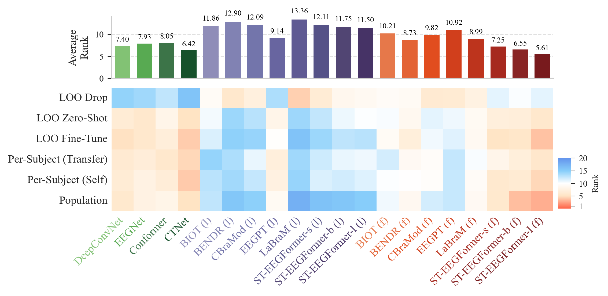

# 3. État de l’art : du décodage EEG classique aux modèles de fondation

Ce chapitre fixe le vocabulaire et les repères nécessaires pour lire les chapitres suivants. Il est écrit pour un lecteur ingénieur qui ne travaille pas sur l’EEG : chaque notion est introduite avant d’être utilisée. Les affirmations chiffrées attribuées à des publications sont issues du texte de ces publications ; celles qui viennent du code du dépôt ST-EEGFormer sont signalées comme telles.

## 3.1 L’EEG en trois propriétés utiles

L’**électroencéphalographie** (EEG) mesure, à la surface du crâne, les variations de potentiel électrique produites par l’activité synchrone de larges populations de neurones. C’est une mesure non invasive, peu coûteuse, à très bonne résolution temporelle (quelques millisecondes) mais à faible résolution spatiale : chaque électrode intègre l’activité de plusieurs centimètres carrés de cortex, filtrée par le crâne et le scalp.

Trois propriétés du signal expliquent l’essentiel des difficultés rencontrées pendant ce stage.

1. **Rapport signal/bruit très défavorable.** L’activité liée à la tâche ne représente qu’une fraction de l’amplitude totale, noyée dans l’activité de fond, les artefacts oculaires et musculaires et le bruit secteur (50 ou 60 Hz). D’où le poids déterminant du prétraitement — filtrage, référencement, correction de ligne de base. Sans lui, aucun décodeur, aussi gros soit-il, ne fonctionne : le chapitre 5 montre que c’est exactement ce qui s’est produit sur notre première conversion de données.
2. **Non-stationnarité et variabilité inter-individuelle.** L’anatomie, l’impédance des électrodes, la stratégie mentale du sujet et sa fatigue modifient la relation entre signal et étiquette. Un décodeur appris sur un sujet ne se transpose pas mécaniquement à un autre : c’est le problème du **transfert inter-sujets**, au cœur du protocole *leave-one-subject-out* utilisé aux chapitres 4 et 6.
3. **Hétérogénéité des montages.** Le nombre d’électrodes, leur position (nomenclatures 10-20 / 10-10) et la fréquence d’échantillonnage varient d’un laboratoire à l’autre. Un modèle pré-entraîné doit donc savoir quoi faire d’un montage qu’il n’a jamais vu — question qui revient au chapitre 7 sous la forme du mapping de canaux et du rééchantillonnage.

Une **interface cerveau–ordinateur** (BCI, *brain–computer interface*) exploite ce signal pour inférer une intention ou un état : imagerie motrice (imaginer un mouvement), potentiels évoqués (P300, ERN), potentiels visuels stationnaires (SSVEP), ou — comme ici — **attention spatiale couverte** (porter son attention à gauche ou à droite sans bouger les yeux).

## 3.2 Les décodeurs « classiques » : une base de comparaison qui tient

Avant l’apprentissage profond, la BCI s’est construite sur une chaîne explicite : filtrer, extraire des descripteurs interprétables, classer avec un modèle linéaire.

- **CSP** (*Common Spatial Patterns*, Ramoser et al., 2000) et son extension par bancs de filtres **FBCSP** (Ang et al., 2008) apprennent des filtres spatiaux qui maximisent le contraste de variance entre deux classes. C’est la référence historique de l’imagerie motrice, et c’est aussi la piste suggérée par le professeur Ishii le 19 août 2026 pour l’attention spatiale.
- Les **classifieurs riemanniens** (Congedo et al., 2017) traitent les matrices de covariance des essais comme des points d’une variété courbe, ce qui apporte une robustesse notable en petit régime de données.
- Pour les SSVEP, **FBCCA** (Chen et al., 2015) et **TRCA** (Nakanishi et al., 2018) exploitent la structure fréquentielle du stimulus et restent difficiles à battre.
- L’**analyse discriminante linéaire** (LDA) est le classifieur linéaire minimal. C’est celui que nous utilisons comme témoin au chapitre 6, sur des descripteurs élémentaires (moyenne et variance par canal).

Sont ensuite arrivés des **réseaux convolutifs compacts** conçus pour l’EEG : **DeepConvNet** (Schirrmeister et al., 2017), **EEGNet** (Lawhern et al., 2018), puis des architectures hybrides convolution + attention comme **EEG Conformer** (Song et al., 2023) et **CTNet** (Zhao et al., 2024). Leur particularité : quelques dizaines de milliers à quelques millions de paramètres — trois à quatre ordres de grandeur sous les modèles de fondation — pour des performances qui restent, sur beaucoup de jeux BCI, très compétitives.

Ce point est essentiel pour la suite : dans le domaine BCI, **la baseline classique n’est pas un homme de paille**. Toute affirmation de progrès doit lui être opposée.

## 3.3 Ce qu’un « modèle de fondation » signifie pour l’EEG

Un **modèle de fondation** (*foundation model*, FM) est un grand modèle pré-entraîné de façon **auto-supervisée** sur de grandes quantités de données non annotées, puis adapté à des tâches aval. « Auto-supervisé » signifie que la cible d’apprentissage est fabriquée à partir du signal lui-même — par exemple masquer une partie du signal et demander au modèle de la reconstruire — et non fournie par un annotateur humain. C’est la recette qui a fait le succès des modèles de langue, puis de la vision.

Deux modes d’adaptation aval doivent être distingués, car ils structurent toute la littérature.

| Mode | Ce qu’on entraîne | Ce que cela mesure |
|---|---|---|
| **Sonde linéaire** (*linear probing*) | une seule couche linéaire, encodeur **gelé** | la qualité intrinsèque des représentations pré-entraînées |
| **Fine-tuning** | l’encodeur **entier** et la tête | ce que le modèle peut atteindre après adaptation |

Le pari du domaine EEG est qu’un pré-entraînement massif produise des représentations réutilisables d’un montage, d’un sujet et d’un paradigme à l’autre, ce qui éviterait de repartir de zéro à chaque expérience. Les principaux modèles publiés avant ce stage :

| Modèle | Année | Représentation du signal | Objectif auto-supervisé |
|---|---|---|---|
| **BENDR** (Kostas et al.) | 2021 | convolutions puis transformeur | masquage + contrastif |
| **BIOT** (Yang et al.) | 2023 | tokenisation par canal, montage bipolaire | pré-entraînement masqué |
| **LaBraM** (Jiang et al.) | 2024 | **tokens discrets** (quantification vectorielle) | prédiction de tokens masqués |
| **EEGPT** (Wang et al.) | 2024 | patches, alignement de représentations | auto-supervision sur représentations |
| **CBraMod** (Wang et al.) | 2025 | patches, attention *criss-cross* | reconstruction masquée locale et globale |

C’est ce panorama que j’ai présenté au séminaire du laboratoire vers le 10 avril 2026, à partir de la revue *EEG Foundation Models: A Critical Review of Current Progress and Future Directions* remise par le professeur Ishii. **Remarque de traçabilité :** seul le support de présentation que j’ai construit est présent sur la machine de rédaction ; le PDF de la revue lui-même ne s’y trouve pas. Je ne cite donc de cette revue que ce que mon propre support atteste, sans lui attribuer de chiffres.

Un point de vocabulaire mérite d’être isolé, car il a occupé deux réunions du laboratoire (6 et 13 août 2026) : **« tokenisation » ne désigne pas la même opération selon les modèles.** Dans LaBraM, chaque morceau de signal est remplacé par l’indice d’un mot dans un dictionnaire appris (*codebook*, quantification vectorielle) : la représentation est **discrète** et l’objectif d’apprentissage est une classification sur ces indices. Dans un ViT appliqué au signal brut, chaque morceau est projeté linéairement en un vecteur : la représentation reste **continue** et l’objectif est une régression du signal. Les deux familles se disent « masquées » ; elles ne prédisent pas la même chose.

## 3.4 ST-EEGFormer (Yang, Sun, Li & Van Hulle, ICLR 2026)

Le papier retenu comme support du stage est *Are EEG Foundation Models Worth It? Comparative Evaluation with Traditional Decoders in Diverse BCI Tasks*, accepté à ICLR 2026, produit par le laboratoire de neuro- et psychophysiologie de la KU Leuven, avec un code publié sous licence MIT. *Note d’accès : la page OpenReview du papier n’a pas pu être consultée depuis la machine de rédaction (page de vérification anti-robot). Les éléments cités ci-dessous proviennent du PDF de l’article et de son matériel supplémentaire, ainsi que du dépôt de code.*

### 3.4.1 La question posée

Le titre est une question, et c’est la contribution principale : **les modèles de fondation EEG valent-ils leur coût** face aux décodeurs traditionnels ? Les auteurs reprochent à la littérature trois faiblesses : évaluation sur un ou deux protocoles seulement, absence de tests statistiques, absence de comparaison aux méthodes classiques non neuronales. Ils construisent donc une grille : cinq modèles de fondation publiés plus le leur, chacun en sonde linéaire **et** en fine-tuning, face à quatre réseaux convolutifs compacts et à un ensemble de décodeurs classiques, sur sept tâches de classification et deux tâches de régression, selon six protocoles, avec tests non paramétriques (Wilcoxon apparié, permutation, Mann–Whitney U) et correction de Bonferroni.

**ST-EEGFormer** (*spatiotemporal EEGFormer*) est introduit dans ce cadre non comme l’architecture ultime, mais comme un **témoin volontairement simple**. L’enjeu est explicite : LaBraM avait avancé que l’auto-encodage masqué sur EEG brut ne converge pas correctement, ce qui justifiait des objectifs de pré-entraînement plus élaborés. Si un ViT pré-entraîné uniquement par MAE sur le signal brut se révèle compétitif après fine-tuning, cette justification tombe.

### 3.4.2 Architecture

L’architecture suit la recette **ViT** (Dosovitskiy et al., 2021), transposée au signal.

- **Découpage en patches spatio-temporels.** Chaque *token* est un court segment temporel d’**un seul canal**. Dans le code (`PatchEmbedEEG`, `benchmark/neural_networks/models/models_vit_eeg.py`), c’est un `torch.nn.Unfold` de noyau et de pas 16 échantillons — donc des patches **non recouvrants** — suivi d’un `nn.Linear(16, embed_dim)`. À 128 Hz, un patch représente 125 ms d’un canal. **Il n’y a ni dictionnaire, ni recherche du plus proche voisin, ni indice discret** : c’est un plongement continu.
- **Deux encodages positionnels.** Un encodage **temporel** sinusoïdal (`TemporalPositionalEncoding`, comme dans le Transformer original) indique *quand* ; un plongement **spatial appris** (`ChannelPositionalEmbed`, table `nn.Embedding(145, embed_dim)`) indique *quelle électrode*. Un *token* de classe est ajouté en tête, comme dans un ViT.
- **Attention plate canal × temps.** Tous les patches, toutes électrodes et tous instants confondus, forment **une seule séquence**. L’auto-attention est celle d’un ViT standard, non causale : un patch du canal C3 à t = 1 s peut attendre un patch de Oz à t = 3 s. Attention inter-canaux et attention temporelle vivent donc dans **le même softmax** ; il n’y a pas de bloc « axe des canaux » séparé.
- **Trois tailles**, définies dans le code : *small* (dimension 512, 8 blocs, 8 têtes), *base* (768, 12, 12) et *large* (1024, 24, 16), toutes avec des patches de 16 échantillons. La variante *large*, celle que nous utilisons, dépasse 300 millions de paramètres (environ 302 M mesurés dans nos journaux d’exécution).

### 3.4.3 Le pré-entraînement : MAE, et rien d’autre

Le pré-entraînement est un **auto-encodeur masqué** (MAE, He et al., 2022) :

1. 75 % des *tokens* sont masqués aléatoirement ;
2. l’encodeur ne voit **que** les *tokens* visibles ;
3. les *tokens* masqués sont réinsérés à leur position, avec leurs encodages positionnels ;
4. un décodeur plus léger (512 dimensions, 8 blocs dans le code) traite la séquence complète ;
5. une couche `nn.Linear(decoder_dim, patch_size)` prédit les **16 valeurs d’échantillons** de chaque patch ;
6. la perte est l’**erreur quadratique moyenne** entre patches prédits et patches vrais, **moyennée uniquement sur les patches masqués** (`forward_loss`, `pretrain/models_mae_eeg.py`).

Autrement dit, la cible d’apprentissage est le signal lui-même — des amplitudes — et non un indice de dictionnaire. C’est la différence de fond avec LaBraM, et la raison pour laquelle l’analogie avec les modèles d’imagerie calcique du laboratoire (§ 3.6) fonctionne.

Le coût de ce pré-entraînement est documenté par les auteurs, ce qui est rare et directement exploitable pour la section RSE du chapitre 2 : plus de **8 millions de segments EEG** issus d’une douzaine de jeux publics et d’un jeu interne, fenêtres de **6 s** avec pas de 0,5 s, prétraitement minimal (notch, passe-bande 0,1–64 Hz, rééchantillonnage à **128 Hz**, standardisation par canal), couverture de **142 électrodes distinctes**, 400 epochs sur une configuration de **16 GPU A100-80 Go**, pour un total déclaré de **32 614 heures·GPU**.

### 3.4.4 L’adaptation aval

Au fine-tuning, le décodeur MAE est **jeté** ; seul l’encodeur est conservé. Il n’y a plus de masquage : la séquence complète est encodée, les *tokens* sont fusionnés (par moyenne, choix par défaut de ST-EEGFormer, les auteurs montrant en annexe que le *token* de classe seul fait moins bien) et une tête linéaire produit la classe ou la valeur régressée.

Deux mises en garde du papier ont directement servi ce stage. D’abord, **la sonde linéaire est faible presque partout** : les représentations pré-entraînées ne sont pas prêtes à l’emploi, sauf sur une tâche facile de détection (ERN) où elles saturent. Ensuite, les auteurs pointent des **facteurs cachés d’implémentation** : certains modèles utilisent des têtes multi-couches tout en annonçant du *linear probing* — la capacité est alors dissimulée dans la tête — et la stratégie de fusion des *tokens* change le champ réceptif effectif. Comparer deux dorsales exige donc de standardiser la tête ; c’est l’une des contributions de loyauté du benchmark.

### 3.4.5 Les six protocoles d’évaluation

La contribution méthodologique du papier est cette grille, reprise telle quelle dans notre vocabulaire de travail.

| # | Protocole | Définition | Ce qu’il interroge |
|---|---|---|---|
| 1 | **Population** | un modèle entraîné sur les données regroupées de tous les sujets, testé sur chacun | motifs partagés ; régime riche en données |
| 2 | **Per-subject (self)** | un modèle par sujet, testé sur lui-même | BCI classique calibrée par utilisateur ; régime pauvre |
| 3 | **Per-subject (transfer)** | modèle du sujet A testé sur le sujet B | transférabilité d’un modèle individuel |
| 4 | **LOO zero-shot** | entraînement sur tous sauf un, test sur l’exclu **sans adaptation** | déploiement direct sur un nouvel utilisateur |
| 5 | **LOO fine-tune** | idem, puis adaptation limitée sur l’exclu | coût de calibration d’un nouvel utilisateur |
| 6 | **LOO drop** | perte de performance sur les autres sujets après cette adaptation | oubli catastrophique |

Le protocole que nous appelons **LOSO** au chapitre 6 correspond au protocole 5 appliqué à nos 43 sujets. Le protocole 1 est celui de notre résultat principal.

### 3.4.6 Les résultats du benchmark

Le résultat de synthèse est un **rang moyen** agrégé sur les jeux, les métriques, les sujets et les six protocoles : plus le rang est petit, meilleur est le modèle. Attention à la notation, source classique de confusion : le suffixe `-s`/`-b`/`-l` désigne la **taille** (small, base, large) et la lettre entre parenthèses le **mode d’adaptation** — `(f)` fine-tuning, `(l)` sonde linéaire.

| Modèle | Rang moyen |
|---|---|
| **ST-EEGFormer-l (f)** | **5,61** |
| CTNet (réseau convolutif compact, sans pré-entraînement) | 6,42 |
| ST-EEGFormer-b (f) | 6,55 |
| ST-EEGFormer-s (f) | 7,25 |
| LaBraM (f) | 8,99 |
| ST-EEGFormer-l (l) | 11,50 |
| LaBraM (l) | 13,36 |

Quatre conclusions en découlent, et elles ont servi de fil rouge à tout le stage.

1. **La sonde linéaire est faible et dépend fortement de la tâche.** Le fine-tuning est en pratique nécessaire.
2. **Les FM ne sont pas universellement meilleurs.** Ils dominent en régime riche (population) mais ne surpassent pas significativement les réseaux compacts, ni parfois les méthodes classiques, en régime pauvre ou par sujet. Nos 43 sujets se situent précisément dans ce régime.
3. **Pas de loi d’échelle claire.** Plus gros n’est pas fiablement meilleur sur ces jeux BCI, alors que le temps de calcul croît vite : le goulot d’étranglement est la taille des jeux de données, non celle du modèle. Les auteurs appellent d’ailleurs à construire un « ImageNet de l’EEG », qui n’existe pas.
4. **Un pré-entraînement simple suffit.** Le MAE brut atteint le meilleur rang moyen après fine-tuning ; les écarts avec des pré-entraînements plus complexes s’estompent largement après adaptation, ce que les auteurs corroborent par des cartes d’attention nettement modifiées par le fine-tuning.

**Figure 3.1.** Rangs moyens du benchmark (figure 3 du papier Yang et al., ICLR 2026). Vert : réseaux convolutifs classiques ; violet : sondes linéaires ; rouge : fine-tuning complet. Rappel de notation : `-l` = *large*, `(l)` = sonde linéaire, `(f)` = fine-tuning.

## 3.5 LaBraM, le contrepoint discret

**LaBraM** (Jiang et al., 2024) est la ligne suivie en parallèle par Liz Costato, ce qui en fait le point de comparaison naturel de ce stage. Sa mécanique est en deux étapes : un **tokeniseur neuronal** quantifie chaque patch, canal par canal, en un code discret issu d’un dictionnaire appris ; un transformeur est ensuite pré-entraîné à prédire les codes masqués à partir de leur contexte — schéma directement inspiré de la modélisation de langue masquée. Les modèles publiés ont été pré-entraînés sur environ 2 500 heures d’EEG issues d’une vingtaine de jeux ; c’est le point de contrôle `labram-base` qui est utilisé au laboratoire.

Le contraste avec ST-EEGFormer se résume en quatre lignes.

| | ST-EEGFormer | LaBraM |
|---|---|---|
| Représentation | patches **continus** (Unfold + Linear) | **tokens discrets** (quantification vectorielle) |
| Objectif auto-supervisé | MSE sur les échantillons masqués | prédiction des codes masqués |
| Attention | un ViT plat sur la séquence canal × temps | transformeur sur tokens discrets |
| Rang moyen après fine-tuning (Yang et al.) | 5,61 | 8,99 |

Il faut lire ce tableau pour ce qu’il est : un classement **dans ce benchmark**. Le papier ne conclut pas que LaBraM est inutile, mais que la complexité supplémentaire d’un tokeniseur discret ne se traduit pas clairement par un gain aval **après fine-tuning**. Le fait que nos deux lignes de travail arrivent autour de 62 % sur la même tâche de laboratoire (chapitre 6) est cohérent avec cette lecture.

## 3.6 Un détour utile : les modèles de fondation en imagerie calcique

À partir d’août 2026, le laboratoire a lancé un *paper reading club* croisant EEG et **imagerie calcique bi-photonique**, à la demande du professeur Ishii. Ce détour n’est pas décoratif : il a clarifié la position exacte du modèle que j’évaluais.

- **CalM** (arXiv 2604.04958) construit un **tokeniseur à quantification vectorielle** sur l’activité neuronale, puis un transformeur *dual-axis* autorégressif (un axe « neurones », un axe « temps »).
- **CAPT** (arXiv 2607.23258) supprime ce dictionnaire : patches **continus**, objectif autorégressif en MSE de bout en bout, transfert inter-espèces à dorsale gelée. Il surpasse CalM.

L’analogie qui en résulte, et que j’ai présentée au laboratoire les 13 et 19 août 2026, est directement utile :

> **ST-EEGFormer ≈ CAPT** (représentation continue, reconstruction du signal) · **LaBraM ≈ CalM** (représentation discrète, prédiction de codes).

L’intérêt pratique de cette mise en correspondance est double. D’une part, elle a corrigé une erreur que j’avais commise le 6 août en décrivant ST-EEGFormer comme « tokenisé » : la lecture du code montre l’inverse. D’autre part, elle déplace la question de recherche. L’idée « se passer de tokenisation » est **déjà réalisée** du côté EEG ; ce qui reste à importer du côté calcique, c’est la stratégie d’auto-supervision et d’**invariance d’identité** — retirer l’identité du neurone, et par analogie celle de l’électrode — qui, dans les travaux du laboratoire, améliore la transférabilité tout en réduisant le nombre de paramètres.

Le laboratoire dispose enfin d’une troisième ligne, celle de **POYO** (Azabou et al., NeurIPS 2023) et de son implémentation `torch_brain`, modèle de fondation pour l’activité de populations neuronales enregistrées en électrophysiologie, ainsi que de **POCO** côté prévision d’activité calcique. Mon travail d’avril a consisté à faire tourner cette ligne (chapitre 5) : c’est le contexte technique dans lequel s’insère la comparaison EEG.

## 3.7 Positionnement du stage

L’état de l’art laisse ouverte une question que le laboratoire pouvait trancher avec ses propres données :

> Sur une tâche d’attention spatiale de laboratoire — 2 classes, 43 sujets, montage 64 canaux absent du pré-entraînement — que vaut un modèle de fondation EEG fine-tuné face à un second modèle de fondation de conception opposée (discrète) et face à une baseline linéaire, à prétraitement et protocole strictement identiques ?

Trois éléments donnent son intérêt à cette question. Le régime est celui, **petit N**, où Yang et al. annoncent que les FM perdent leur avantage. La comparaison est **appariée** : même jeu, même prétraitement, deux dorsales de familles opposées, une baseline linéaire commune. Enfin, le résultat reste informatif même s’il est « négatif » : si les deux FM se rejoignent, cela conforte la quatrième conclusion du papier plutôt que d’élire un vainqueur. Le chapitre 4 décrit les moyens mis en œuvre pour y répondre.
