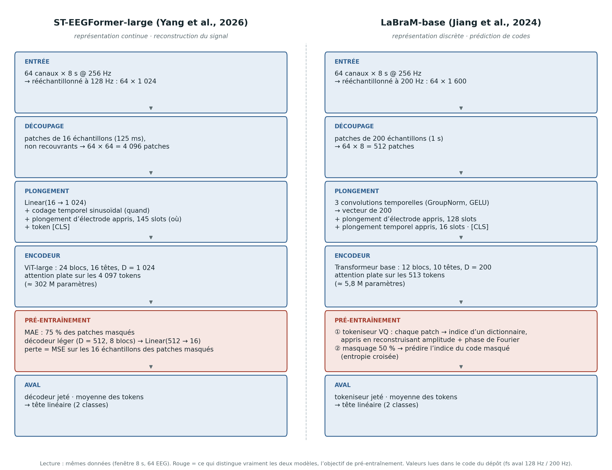

# 3. État de l’art : du décodage EEG classique aux modèles de fondation

Ce chapitre fixe le vocabulaire et les repères nécessaires pour lire les chapitres suivants. Il est écrit pour un lecteur ingénieur qui ne travaille pas sur l’EEG : chaque notion est introduite avant d’être utilisée. Les affirmations chiffrées attribuées à des publications sont issues du texte de ces publications ; celles qui viennent du code du dépôt ST-EEGFormer sont signalées comme telles.

## 3.1 L’EEG en trois propriétés utiles

L’**électroencéphalographie** (EEG) mesure, à la surface du crâne, les variations de potentiel électrique produites par l’activité synchrone de larges populations de neurones. C’est une mesure non invasive, peu coûteuse, à très bonne résolution temporelle (quelques millisecondes) mais à faible résolution spatiale : chaque électrode intègre l’activité de plusieurs centimètres carrés de cortex, filtrée par le crâne et le scalp.

Trois propriétés du signal expliquent l’essentiel des difficultés rencontrées pendant ce stage.

1. **Rapport signal/bruit très défavorable.** L’activité liée à la tâche ne représente qu’une fraction de l’amplitude totale, noyée dans l’activité de fond, les artefacts oculaires et musculaires et le bruit secteur (50 ou 60 Hz). D’où le poids déterminant du prétraitement — filtrage, référencement, correction de ligne de base. Sans lui, aucun décodeur, aussi gros soit-il, ne fonctionne : le chapitre 5 montre que c’est exactement ce qui s’est produit sur notre première conversion de données.
2. **Non-stationnarité et variabilité inter-individuelle.** L’anatomie, l’impédance des électrodes, la stratégie mentale du sujet et sa fatigue modifient la relation entre signal et étiquette. Un décodeur appris sur un sujet ne se transpose pas mécaniquement à un autre : c’est le problème du **transfert inter-sujets**, au cœur du protocole *leave-one-subject-out* utilisé aux chapitres 4 et 6.
3. **Hétérogénéité des montages.** Le nombre d’électrodes, leur position (nomenclatures 10-20 / 10-10) et la fréquence d’échantillonnage varient d’un laboratoire à l’autre. Un modèle pré-entraîné doit donc savoir quoi faire d’un montage qu’il n’a jamais vu — question qui revient au chapitre 7 sous la forme du mapping de canaux et du rééchantillonnage.

Une **interface cerveau–ordinateur** (BCI, *brain–computer interface*) exploite ce signal pour inférer une intention ou un état : imagerie motrice (imaginer un mouvement), potentiels évoqués (P300, ERN), potentiels visuels stationnaires (SSVEP), ou — comme ici — **attention spatiale couverte** (porter son attention à gauche ou à droite sans bouger les yeux).

## 3.2 Les décodeurs « classiques » : une base de comparaison qui tient

Avant l’apprentissage profond, la BCI s’est construite sur une chaîne explicite : filtrer, extraire des descripteurs interprétables, classer avec un modèle linéaire.

- **CSP** (*Common Spatial Patterns*, Ramoser et al., 2000) et son extension par bancs de filtres **FBCSP** (Ang et al., 2008) apprennent des filtres spatiaux qui maximisent le contraste de variance entre deux classes. C’est la référence historique de l’imagerie motrice, et c’est aussi la piste suggérée par le professeur Ishii le 19 août 2026 pour l’attention spatiale.
- Les **classifieurs riemanniens** (Congedo et al., 2017) traitent les matrices de covariance des essais comme des points d’une variété courbe, ce qui apporte une robustesse notable en petit régime de données.
- Pour les SSVEP, **FBCCA** (Chen et al., 2015) et **TRCA** (Nakanishi et al., 2018) exploitent la structure fréquentielle du stimulus et restent difficiles à battre.
- L’**analyse discriminante linéaire** (LDA) est le classifieur linéaire minimal. C’est celui que nous utilisons comme témoin au chapitre 6, sur des descripteurs élémentaires (moyenne et variance par canal).

Sont ensuite arrivés des **réseaux convolutifs compacts** conçus pour l’EEG : **DeepConvNet** (Schirrmeister et al., 2017), **EEGNet** (Lawhern et al., 2018), puis des architectures hybrides convolution + attention comme **EEG Conformer** (Song et al., 2023) et **CTNet** (Zhao et al., 2024). Leur particularité : quelques dizaines de milliers à quelques millions de paramètres — trois à quatre ordres de grandeur sous les modèles de fondation — pour des performances qui restent, sur beaucoup de jeux BCI, très compétitives.

Ce point est essentiel pour la suite : dans le domaine BCI, **la baseline classique n’est pas un homme de paille**. Toute affirmation de progrès doit lui être opposée.

## 3.3 Ce qu’un « modèle de fondation » signifie pour l’EEG

Un **modèle de fondation** (*foundation model*, FM) est un grand modèle pré-entraîné de façon **auto-supervisée** sur de grandes quantités de données non annotées, puis adapté à des tâches aval. « Auto-supervisé » signifie que la cible d’apprentissage est fabriquée à partir du signal lui-même — par exemple masquer une partie du signal et demander au modèle de la reconstruire — et non fournie par un annotateur humain. C’est la recette qui a fait le succès des modèles de langue, puis de la vision.

Deux modes d’adaptation aval doivent être distingués, car ils structurent toute la littérature.

| Mode | Ce qu’on entraîne | Ce que cela mesure |
|---|---|---|
| **Sonde linéaire** (*linear probing*) | une seule couche linéaire, encodeur **gelé** | la qualité intrinsèque des représentations pré-entraînées |
| **Fine-tuning** | l’encodeur **entier** et la tête | ce que le modèle peut atteindre après adaptation |

Le pari du domaine EEG est qu’un pré-entraînement massif produise des représentations réutilisables d’un montage, d’un sujet et d’un paradigme à l’autre, ce qui éviterait de repartir de zéro à chaque expérience. Les principaux modèles publiés avant ce stage :

| Modèle | Année | Représentation du signal | Objectif auto-supervisé |
|---|---|---|---|
| **BENDR** (Kostas et al.) | 2021 | convolutions puis transformeur | masquage + contrastif |
| **BIOT** (Yang et al.) | 2023 | tokenisation par canal, montage bipolaire | pré-entraînement masqué |
| **LaBraM** (Jiang et al.) | 2024 | **tokens discrets** (quantification vectorielle) | prédiction de tokens masqués |
| **EEGPT** (Wang et al.) | 2024 | patches, alignement de représentations | auto-supervision sur représentations |
| **CBraMod** (Wang et al.) | 2025 | patches, attention *criss-cross* | reconstruction masquée locale et globale |

C’est ce panorama que j’ai présenté au séminaire du laboratoire vers le 10 avril 2026, à partir de la revue *EEG Foundation Models: A Critical Review of Current Progress and Future Directions* remise par le professeur Ishii (Kuruppu, Wagh, Kremen & Varatharajah, *Journal of Neural Engineering*, 2026 ; prépublication arXiv de juillet 2025). Cette revue compare dix modèles de fondation EEG précoces selon trois axes — représentation de l’entrée, objectif auto-supervisé, stratégie d’évaluation — et conclut que la plupart reposent sur un transformeur et sur la reconstruction de séquences temporelles masquées, tandis que les évaluations restent hétérogènes et trop limitées pour juger de leur utilité « prêt-à-l’emploi ». C’est exactement la question que pose le papier support, et celle que ce stage instancie sur un jeu de données de laboratoire.

Un point de vocabulaire mérite d’être isolé, car il a occupé deux réunions du laboratoire (6 et 13 août 2026) : **« tokenisation » ne désigne pas la même opération selon les modèles.** Dans LaBraM, chaque morceau de signal est remplacé par l’indice d’un mot dans un dictionnaire appris (*codebook*, quantification vectorielle) : la représentation est **discrète** et l’objectif d’apprentissage est une classification sur ces indices. Dans un ViT appliqué au signal brut, chaque morceau est projeté linéairement en un vecteur : la représentation reste **continue** et l’objectif est une régression du signal. Les deux familles se disent « masquées » ; elles ne prédisent pas la même chose.

## 3.4 ST-EEGFormer (Yang, Sun, Li & Van Hulle, ICLR 2026)

Le papier retenu comme support du stage est *Are EEG Foundation Models Worth It? Comparative Evaluation with Traditional Decoders in Diverse BCI Tasks*, accepté à ICLR 2026, produit par le laboratoire de neuro- et psychophysiologie de la KU Leuven, avec un code publié sous licence MIT. *Note d’accès : la page OpenReview du papier n’a pas pu être consultée depuis la machine de rédaction (page de vérification anti-robot). Les éléments cités ci-dessous proviennent du PDF de l’article et de son matériel supplémentaire, ainsi que du dépôt de code.*

### 3.4.1 La question posée

Le titre est une question, et c’est la contribution principale : **les modèles de fondation EEG valent-ils leur coût** face aux décodeurs traditionnels ? Les auteurs reprochent à la littérature trois faiblesses : évaluation sur un ou deux protocoles seulement, absence de tests statistiques, absence de comparaison aux méthodes classiques non neuronales. Ils construisent donc une grille : cinq modèles de fondation publiés plus le leur, chacun en sonde linéaire **et** en fine-tuning, face à quatre réseaux convolutifs compacts et à un ensemble de décodeurs classiques, sur sept tâches de classification et deux tâches de régression, selon six protocoles, avec tests non paramétriques (Wilcoxon apparié, permutation, Mann–Whitney U) et correction de Bonferroni.

**ST-EEGFormer** (*spatiotemporal EEGFormer*) est introduit dans ce cadre non comme l’architecture ultime, mais comme un **témoin volontairement simple**. L’enjeu est explicite : LaBraM avait avancé que l’auto-encodage masqué sur EEG brut ne converge pas correctement, ce qui justifiait des objectifs de pré-entraînement plus élaborés. Si un ViT pré-entraîné uniquement par MAE sur le signal brut se révèle compétitif après fine-tuning, cette justification tombe.

### 3.4.2 L’idée en une phrase, puis l’architecture

L’idée de ST-EEGFormer se résume ainsi : **traiter un enregistrement EEG comme une image dont les « pixels » sont de courts morceaux de signal**, et appliquer sans modification la recette **ViT** (Dosovitskiy et al., 2021) — découper, projeter linéairement, ajouter une information de position, empiler des blocs d’auto-attention. Rien, dans le modèle, n’est spécifique à l’EEG en dehors du découpage et du codage de position. Tout ce qui suit est lu dans le code du dépôt (`benchmark/neural_networks/models/models_vit_eeg.py`), et la figure 2.1 (panneau b) en donne le schéma d’ensemble ; la figure 3.2 (§ 3.5) le met en regard de LaBraM sur nos données.

**Étape 1 — Le découpage (*patchify*).** Le signal d’entrée est une matrice `canaux × temps`. Chaque canal est coupé en segments consécutifs de **16 échantillons**, sans recouvrement (`torch.nn.Unfold`, noyau 16, pas 16). Un segment d’**un seul canal** sur 16 échantillons est un *patch* ; à 128 Hz, il dure **125 ms**. Sur notre fenêtre de 8 s à 64 canaux, rééchantillonnée à 128 Hz (§ 4.3), cela donne 64 patches par canal, soit **64 × 64 = 4 096 patches**.

**Étape 2 — Le plongement (*embedding*).** Chaque patch de 16 valeurs est projeté par **une seule couche linéaire** (`nn.Linear(16, D)`) en un vecteur de dimension *D* (1 024 pour la variante *large*). **Il n’y a ni dictionnaire, ni recherche du plus proche voisin, ni indice discret** : le vecteur est une fonction linéaire continue des 16 amplitudes. C’est ce que nous appelons « représentation continue ».

**Étape 3 — Dire au modèle *quand* et *où*.** Un transformeur ne sait rien de l’ordre de ses entrées ; il faut le lui ajouter. Deux vecteurs sont sommés à chaque plongement :

- un **codage temporel sinusoïdal** (`TemporalPositionalEncoding`, formule du Transformer original, non appris), indexé par le numéro du patch dans la fenêtre : *quand* ;
- un **plongement d’électrode appris** (`ChannelPositionalEmbed`, table `nn.Embedding(145, D)`), indexé par l’identifiant de l’électrode : *où*. Les 145 emplacements couvrent les 142 électrodes distinctes vues au pré-entraînement. C’est ce plongement qui rend nécessaire la traduction de nos noms d’électrodes en indices (§ 4.3).

Un **token de classe** (`[CLS]`) est ajouté en tête de séquence, comme dans un ViT.

**Étape 4 — L’encodeur : une attention « plate » canal × temps.** Les 4 096 patches, toutes électrodes et tous instants confondus, forment **une seule séquence** de 4 097 tokens (avec `[CLS]`). L’encodeur est une pile de blocs Transformer standard (auto-attention multi-têtes puis perceptron, avec normalisations et connexions résiduelles), non causale : un patch de C3 à *t* = 1 s peut attendre un patch de Oz à *t* = 3 s. Attention inter-canaux et attention temporelle vivent dans **le même softmax** ; il n’y a pas de bloc « axe des canaux » séparé, ni de biais structurel imposant une localité. Trois tailles sont définies dans le code :

| Variante | *D* | Blocs | Têtes | Patch |
|---|---:|---:|---:|---:|
| small | 512 | 8 | 8 | 16 |
| base | 768 | 12 | 12 | 16 |
| **large** (utilisée ici) | **1 024** | **24** | **16** | 16 |

La variante *large* compte environ **302 millions de paramètres** (valeur relevée dans nos journaux d’exécution). Le coût de l’attention étant quadratique en nombre de tokens, la longueur 4 097 est ce qui dicte la mémoire GPU (§ 4.5).

### 3.4.3 L’algorithme de pré-entraînement : un auto-encodeur masqué, et rien d’autre

Le pré-entraînement est un **auto-encodeur masqué** (MAE, He et al., 2022) appliqué au signal brut. La boucle d’apprentissage, lue dans `pretrain/models_mae_eeg.py`, est la suivante :

1. **Plonger** tous les patches (étapes 1–3 ci-dessus).
2. **Masquer** aléatoirement **75 %** des patches (`mask_ratio = 0.75`), tirage indépendant pour chaque exemple : on mélange les positions et l’on ne garde que le premier quart.
3. **Encoder** uniquement les 25 % visibles avec l’encodeur complet — c’est ce qui rend le MAE économique, l’encodeur ne voyant jamais les patches masqués.
4. **Réinsérer** les positions masquées sous la forme d’un **vecteur `mask_token` appris**, identique pour toutes, puis ré-additionner à chaque position ses codages temporel et d’électrode (le décodeur possède ses propres tables).
5. **Décoder** la séquence complète avec un décodeur plus **léger** (*D* = 512, 8 blocs pour *base* et *large*).
6. **Prédire** pour chaque position les **16 valeurs d’amplitude** du patch (`nn.Linear(512, 16)`).
7. **Pénaliser** par l’**erreur quadratique moyenne** (MSE) entre patch prédit et patch vrai, calculée **uniquement sur les patches masqués** (`(loss * mask).sum() / mask.sum()`). Une option de normalisation du patch cible existe (`norm_pix_loss`) mais est désactivée par défaut.

La cible d’apprentissage est donc **le signal lui-même**, en amplitudes, et non un indice de dictionnaire. C’est la différence de fond avec LaBraM (§ 3.5), et la raison pour laquelle l’analogie avec les modèles d’imagerie calcique du laboratoire (§ 3.6) fonctionne. C’est aussi ce qui a fait réagir le professeur Ishii le 19 août 2026 : une MSE sur des amplitudes est dominée par l’énergie basse fréquence et les décalages de ligne de base, pas par la structure temporelle fine (chapitre 7).

Le coût de ce pré-entraînement est documenté par les auteurs, ce qui est rare et directement exploitable pour la section RSE du chapitre 2 : plus de **8 millions de segments EEG** issus d’une douzaine de jeux publics et d’un jeu interne, fenêtres de **6 s** avec pas de 0,5 s, prétraitement minimal (notch, passe-bande 0,1–64 Hz, rééchantillonnage à **128 Hz**, standardisation par canal), couverture de **142 électrodes distinctes**, 400 epochs sur une configuration de **16 GPU A100-80 Go**, pour un total déclaré de **32 614 heures·GPU**. Une fenêtre de pré-entraînement représente 6 × 128 / 16 = 48 patches par canal ; notre fenêtre aval de 8 s en représente 64, dans les limites du codage temporel (512 positions).

### 3.4.4 L’adaptation aval (fine-tuning)

Au fine-tuning, le décodeur MAE et le `mask_token` sont **jetés** ; seul l’encodeur est conservé et initialisé avec les poids pré-entraînés. Il n’y a plus de masquage : la séquence complète est encodée, les 4 096 tokens de sortie sont **moyennés** (`global_pool`, le `[CLS]` étant exclu de la moyenne) et une **tête linéaire** unique produit la classe (ici 2 sorties) ou la valeur régressée. La moyenne est le choix par défaut des auteurs, qui montrent en annexe que le `[CLS]` seul fait moins bien. Tous les poids — plongement, 24 blocs, tête — sont mis à jour, avec un taux d’apprentissage éventuellement décroissant vers les couches d’entrée (`layer_decay`, § 4.6).

En sonde linéaire (*linear probing*), seule la tête est apprise ; l’encodeur est gelé.

Deux mises en garde du papier ont directement servi ce stage. D’abord, **la sonde linéaire est faible presque partout** : les représentations pré-entraînées ne sont pas prêtes à l’emploi, sauf sur une tâche facile de détection (ERN) où elles saturent. Ensuite, les auteurs pointent des **facteurs cachés d’implémentation** : certains modèles utilisent des têtes multi-couches tout en annonçant du *linear probing* — la capacité est alors dissimulée dans la tête — et la stratégie de fusion des *tokens* change le champ réceptif effectif. Comparer deux dorsales exige donc de standardiser la tête ; c’est l’une des contributions de loyauté du benchmark.

### 3.4.5 Les six protocoles d’évaluation

La contribution méthodologique du papier est cette grille, reprise telle quelle dans notre vocabulaire de travail.

| # | Protocole | Définition | Ce qu’il interroge |
|---|---|---|---|
| 1 | **Population** | un modèle entraîné sur les données regroupées de tous les sujets, testé sur chacun | motifs partagés ; régime riche en données |
| 2 | **Per-subject (self)** | un modèle par sujet, testé sur lui-même | BCI classique calibrée par utilisateur ; régime pauvre |
| 3 | **Per-subject (transfer)** | modèle du sujet A testé sur le sujet B | transférabilité d’un modèle individuel |
| 4 | **LOO zero-shot** | entraînement sur tous sauf un, test sur l’exclu **sans adaptation** | déploiement direct sur un nouvel utilisateur |
| 5 | **LOO fine-tune** | idem, puis adaptation limitée sur l’exclu | coût de calibration d’un nouvel utilisateur |
| 6 | **LOO drop** | perte de performance sur les autres sujets après cette adaptation | oubli catastrophique |

Le protocole que nous appelons **LOSO** au chapitre 6 correspond au protocole 5 appliqué à nos 43 sujets. Le protocole 1 est celui de notre résultat principal.

### 3.4.6 Les résultats du benchmark

Le résultat de synthèse est un **rang moyen** agrégé sur les jeux, les métriques, les sujets et les six protocoles : plus le rang est petit, meilleur est le modèle. Attention à la notation, source classique de confusion : le suffixe `-s`/`-b`/`-l` désigne la **taille** (small, base, large) et la lettre entre parenthèses le **mode d’adaptation** — `(f)` fine-tuning, `(l)` sonde linéaire.

| Modèle | Rang moyen |
|---|---|
| **ST-EEGFormer-l (f)** | **5,61** |
| CTNet (réseau convolutif compact, sans pré-entraînement) | 6,42 |
| ST-EEGFormer-b (f) | 6,55 |
| ST-EEGFormer-s (f) | 7,25 |
| LaBraM (f) | 8,99 |
| ST-EEGFormer-l (l) | 11,50 |
| LaBraM (l) | 13,36 |

Quatre conclusions en découlent, et elles ont servi de fil rouge à tout le stage.

1. **La sonde linéaire est faible et dépend fortement de la tâche.** Le fine-tuning est en pratique nécessaire.
2. **Les FM ne sont pas universellement meilleurs.** Ils dominent en régime riche (population) mais ne surpassent pas significativement les réseaux compacts, ni parfois les méthodes classiques, en régime pauvre ou par sujet. Nos 43 sujets se situent précisément dans ce régime.
3. **Pas de loi d’échelle claire.** Plus gros n’est pas fiablement meilleur sur ces jeux BCI, alors que le temps de calcul croît vite : le goulot d’étranglement est la taille des jeux de données, non celle du modèle. Les auteurs appellent d’ailleurs à construire un « ImageNet de l’EEG », qui n’existe pas.
4. **Un pré-entraînement simple suffit.** Le MAE brut atteint le meilleur rang moyen après fine-tuning ; les écarts avec des pré-entraînements plus complexes s’estompent largement après adaptation, ce que les auteurs corroborent par des cartes d’attention nettement modifiées par le fine-tuning.

**Figure 3.1.** Rangs moyens du benchmark (figure 3 du papier Yang et al., ICLR 2026). Vert : réseaux convolutifs classiques ; violet : sondes linéaires ; rouge : fine-tuning complet. Rappel de notation : `-l` = *large*, `(l)` = sonde linéaire, `(f)` = fine-tuning.

## 3.5 LaBraM, le contrepoint discret

**LaBraM** (*Large Brain Model*, Jiang, Zhao & Lu, ICLR 2024) est la ligne suivie en parallèle par Liz Costato, ce qui en fait le point de comparaison naturel de ce stage. Le dépôt ST-EEGFormer en embarque une copie du code d’encodeur (`benchmark/neural_networks/models/labram.py`, adapté du dépôt officiel, lui-même dérivé de BEiT-v2) afin de l’évaluer dans les mêmes conditions ; c’est cette copie qui est lue ci-dessous, complétée par l’article pour la partie pré-entraînement, absente du dépôt. Le point de contrôle utilisé au laboratoire est `labram-base`.

L’idée de LaBraM en une phrase : **traiter l’EEG comme un texte**, dont il faut d’abord apprendre le vocabulaire — un dictionnaire fini de « mots » de signal — avant de pré-entraîner un transformeur à deviner les mots manquants, exactement comme un modèle de langue masqué.

### 3.5.1 Architecture de l’encodeur

**Étape 1 — Découpage.** L’entrée est rééchantillonnée à **200 Hz** (fréquence native du modèle ; `model_downstream_task_fs = 200` dans `util/utils.py`) puis coupée, canal par canal, en patches de **200 échantillons, soit 1 s**. Sur notre fenêtre de 8 s à 64 canaux : 8 patches par canal, **64 × 8 = 512 patches** — huit fois moins que ST-EEGFormer, avec des patches huit fois plus longs.

**Étape 2 — Plongement par convolutions.** Là où ST-EEGFormer projette linéairement, LaBraM applique à chaque patch un petit **encodeur temporel convolutif** (`TemporalConv`) : une convolution de noyau 15 et de pas 8, puis deux convolutions de noyau 3, chacune suivie d’une normalisation de groupe et d’une activation GELU. Les 8 cartes de sortie de 25 échantillons sont aplaties en un vecteur de **200** dimensions. Le plongement est donc non linéaire et appris, mais reste **continu** à ce stade — la discrétisation n’intervient qu’au pré-entraînement (§ 3.5.2).

**Étape 3 — *Quand* et *où*, tous deux appris.** Deux tables apprises sont ajoutées : un **plongement d’électrode** (`pos_embed`, 128 emplacements + 1 pour `[CLS]`), indexé par la position de l’électrode dans la liste standard 10-20 étendue du dépôt, et un **plongement temporel** (`time_embed`, 16 emplacements, soit jusqu’à 16 s de fenêtre). Contrairement à ST-EEGFormer, le codage temporel n’est pas sinusoïdal mais appris. Un `[CLS]` est ajouté.

**Étape 4 — Encodeur.** Une pile de blocs Transformer standard, en attention plate sur la séquence canal × temps (513 tokens sur nos données), avec deux raffinements hérités de BEiT-v2 : une normalisation des requêtes et des clés (*qk-norm*) et des facteurs d’échelle appris par bloc (*layer scale*). Trois tailles sont définies :

| Variante | *D* | Blocs | Têtes | Paramètres (papier) |
|---|---:|---:|---:|---:|
| **base** (utilisée au laboratoire) | **200** | **12** | **10** | ≈ 5,8 M |
| large | 400 | 24 | 16 | ≈ 46 M |
| huge | 800 | 48 | 16 | ≈ 369 M |

Le contraste de taille est frappant : `labram-base` compte **cinquante fois moins de paramètres** que ST-EEGFormer-large, et traite huit fois moins de tokens.

### 3.5.2 L’algorithme de pré-entraînement : d’abord un vocabulaire, ensuite un modèle de langue

Le pré-entraînement se fait en **deux temps**, décrits dans l’article (le code correspondant n’est pas dans le dépôt de ce stage).

**Temps 1 — Apprendre le tokeniseur neuronal (quantification vectorielle).** Un premier réseau apprend un **dictionnaire** (*codebook*) de plusieurs milliers de vecteurs (8 192 dans la configuration publiée). Chaque patch de 1 s est plongé, puis **remplacé par le vecteur du dictionnaire le plus proche** ; le patch devient un **indice entier**. Pour que ces indices portent de l’information, un décodeur doit pouvoir reconstruire quelque chose du patch à partir du code. Le choix de LaBraM est déterminant : la cible n’est **pas le signal brut**, mais son **spectre de Fourier — amplitude et phase**. Les auteurs justifient ce choix par la difficulté à faire converger une reconstruction directe d’EEG brut, jugé trop bruité ; c’est précisément l’affirmation que ST-EEGFormer vient contester (§ 3.4.1).

**Temps 2 — Modélisation d’EEG masqué (*masked EEG modeling*).** Le tokeniseur est ensuite gelé et sert d’oracle. Pour chaque fenêtre : (1) tous les patches sont convertis en indices par le tokeniseur ; (2) **50 %** des patches sont masqués en entrée du transformeur ; (3) le transformeur, à partir du contexte visible, **prédit l’indice** du code de chaque patch masqué ; (4) la perte est une **entropie croisée** sur ces indices, comme un problème de classification à 8 192 classes. Le transformeur n’a donc jamais à produire une amplitude : il apprend à prédire *quel mot du vocabulaire* manque, pas *quelle forme d’onde*.

Les modèles publiés ont été pré-entraînés sur environ **2 500 heures** d’EEG issues d’une vingtaine de jeux publics, avec un prétraitement proche du nôtre (passe-bande 0,1–75 Hz, notch, rééchantillonnage à 200 Hz) — ce qui explique que le pipeline de conversion « v2 » du chapitre 4, aligné sur celui de Liz, convienne aux deux modèles.

### 3.5.3 L’adaptation aval

Au fine-tuning, LaBraM fait **la même chose** que ST-EEGFormer : le tokeniseur et l’objectif de pré-entraînement sont abandonnés, l’encodeur est conservé, les tokens de sortie sont **moyennés** (`use_mean_pooling = True`, suivi d’une normalisation) et une **tête linéaire** produit la classe. La partie discrète de LaBraM ne sert qu’au pré-entraînement ; en aval, les deux modèles sont deux encodeurs continus surmontés d’une couche linéaire. C’est ce qui rend la comparaison du chapitre 6 loyale, et ce qui donne son sens à la quatrième conclusion de Yang et al. : *si le fine-tuning efface l’essentiel de la spécialisation acquise au pré-entraînement, la nature de cet objectif — continu ou discret — cesse d’être discriminante*.

### 3.5.4 Les deux modèles point à point

**Figure 3.2.** ST-EEGFormer-large et LaBraM-base, étape par étape, sur une même fenêtre de 8 s à 64 canaux. En rouge, la seule étape où les deux modèles diffèrent fondamentalement : l’objectif de pré-entraînement. Valeurs lues dans le code du dépôt.

| | ST-EEGFormer-large | LaBraM-base |
|---|---|---|
| Fréquence de travail | 128 Hz | 200 Hz |
| Patch | 16 échantillons = 125 ms, un canal | 200 échantillons = 1 s, un canal |
| Tokens pour 8 s × 64 canaux | 4 096 | 512 |
| Plongement du patch | une couche linéaire | trois convolutions + GroupNorm + GELU |
| Position temporelle | sinusoïdale, fixe | table apprise (16 s max) |
| Identité de l’électrode | table apprise, 145 emplacements | table apprise, 128 emplacements |
| Encodeur | 24 blocs, *D* = 1 024, ≈ 302 M param. | 12 blocs, *D* = 200, ≈ 5,8 M param. |
| Représentation pré-entraînée | **continue** | **discrète** (indices d’un dictionnaire VQ) |
| Cible de pré-entraînement | les 16 amplitudes du patch | l’indice du code du patch (dictionnaire appris sur le spectre de Fourier) |
| Perte | MSE sur les patches masqués | entropie croisée sur les indices masqués |
| Taux de masquage | 75 % | 50 % |
| Données de pré-entraînement | > 8 M de segments de 6 s, 142 électrodes | ≈ 2 500 h, ≈ 20 jeux |
| Aval | encodeur + moyenne des tokens + tête linéaire | identique |
| Rang moyen après fine-tuning (Yang et al.) | 5,61 | 8,99 |

Trois lectures de ce tableau.

1. **Ce qui est identique** : la logique ViT (patch par canal, plongement, position, attention plate, moyenne, tête linéaire) et l’adaptation aval. Un lecteur qui comprend l’un comprend l’autre.
2. **Ce qui diffère vraiment** : la *cible* du pré-entraînement. ST-EEGFormer fait une régression des amplitudes ; LaBraM fait une classification d’indices dont le dictionnaire encode le spectre. Les deux se disent « masqués » mais ne prédisent pas la même chose — c’est la confusion levée au § 3.3.
3. **Ce qui diffère en échelle** : cinquante fois plus de paramètres et huit fois plus de tokens côté ST-EEGFormer, avec des patches huit fois plus courts. Ce sont deux régimes différents de résolution temporelle et de coût, ce qui compte pour la suite (chapitre 7) : améliorer l’un n’est pas nécessairement améliorer l’autre.

Il faut lire la dernière ligne pour ce qu’elle est : un classement **dans le benchmark de Yang et al.** Le papier ne conclut pas que LaBraM est inutile, mais que la complexité supplémentaire d’un tokeniseur discret ne se traduit pas clairement par un gain aval **après fine-tuning**. Le fait que nos deux lignes de travail arrivent autour de 62 % sur la même tâche de laboratoire (chapitre 6) est cohérent avec cette lecture.

## 3.6 Un détour utile : les modèles de fondation en imagerie calcique

À partir d’août 2026, le laboratoire a lancé un *paper reading club* croisant EEG et **imagerie calcique bi-photonique**, à la demande du professeur Ishii. Ce détour n’est pas décoratif : il a clarifié la position exacte du modèle que j’évaluais.

- **CalM** (arXiv 2604.04958) construit un **tokeniseur à quantification vectorielle** sur l’activité neuronale, puis un transformeur *dual-axis* autorégressif (un axe « neurones », un axe « temps »).
- **CAPT** (arXiv 2607.23258) supprime ce dictionnaire : patches **continus**, objectif autorégressif en MSE de bout en bout, transfert inter-espèces à dorsale gelée. Il surpasse CalM.

L’analogie qui en résulte, et que j’ai présentée au laboratoire les 13 et 19 août 2026, est directement utile :

> **ST-EEGFormer ≈ CAPT** (représentation continue, reconstruction du signal) · **LaBraM ≈ CalM** (représentation discrète, prédiction de codes).

L’intérêt pratique de cette mise en correspondance est double. D’une part, elle a corrigé une erreur que j’avais commise le 6 août en décrivant ST-EEGFormer comme « tokenisé » : la lecture du code montre l’inverse. D’autre part, elle déplace la question de recherche. L’idée « se passer de tokenisation » est **déjà réalisée** du côté EEG ; ce qui reste à importer du côté calcique, c’est la stratégie d’auto-supervision et d’**invariance d’identité** — retirer l’identité du neurone, et par analogie celle de l’électrode — qui, dans les travaux du laboratoire, améliore la transférabilité tout en réduisant le nombre de paramètres.

Le laboratoire dispose enfin d’une troisième ligne, celle de **POYO** (Azabou et al., NeurIPS 2023) et de son implémentation `torch_brain`, modèle de fondation pour l’activité de populations neuronales enregistrées en électrophysiologie, ainsi que de **POCO** côté prévision d’activité calcique. Mon travail d’avril a consisté à faire tourner cette ligne (chapitre 5) : c’est le contexte technique dans lequel s’insère la comparaison EEG.

## 3.7 Positionnement du stage

L’état de l’art laisse ouverte une question que le laboratoire pouvait trancher avec ses propres données :

> Sur une tâche d’attention spatiale de laboratoire — 2 classes, 43 sujets, montage 64 canaux absent du pré-entraînement — que vaut un modèle de fondation EEG fine-tuné face à un second modèle de fondation de conception opposée (discrète) et face à une baseline linéaire, à prétraitement et protocole strictement identiques ?

Trois éléments donnent son intérêt à cette question. Le régime est celui, **petit N**, où Yang et al. annoncent que les FM perdent leur avantage. La comparaison est **appariée** : même jeu, même prétraitement, deux dorsales de familles opposées, une baseline linéaire commune. Enfin, le résultat reste informatif même s’il est « négatif » : si les deux FM se rejoignent, cela conforte la quatrième conclusion du papier plutôt que d’élire un vainqueur. Le chapitre 4 décrit les moyens mis en œuvre pour y répondre.
