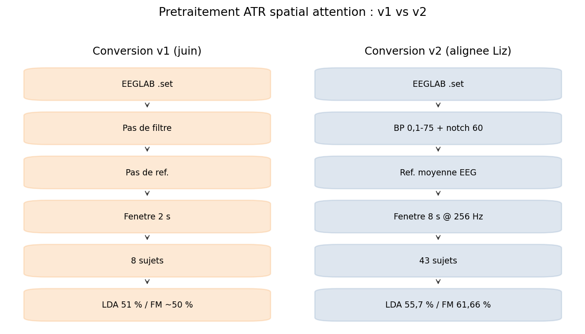
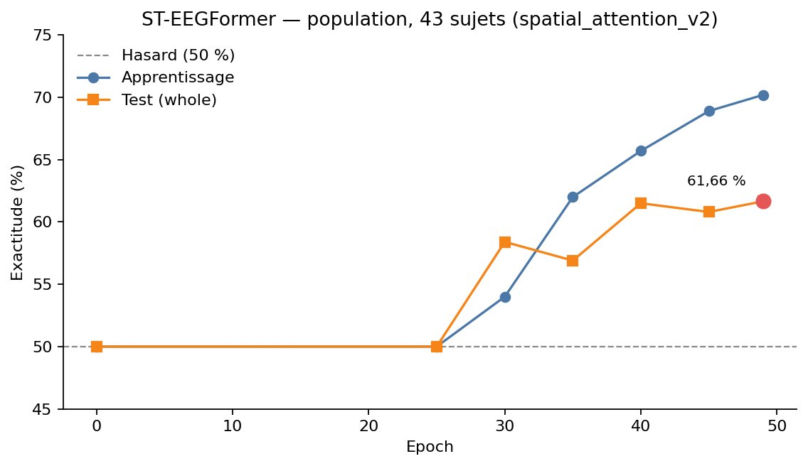

# 6. Résultats

Sauf mention contraire, tous les chiffres de ce chapitre viennent du journal de bord et de l’agrégation `summarize_g2_json_logs.py`. Le mean LOSO ci-dessous est celui du **2 septembre 2026** (41 plis, stade *finetune*).

## 6.1 Contrôle négatif : BCI Competition IV-2a

Sur BCI-IV-2a (4 classes, hasard = 25 %), les runs population et leave-one-out du pipeline ST-EEGFormer se sont établis autour de **25–26 %**. Ce niveau ne permet pas de discuter le modèle : il indique que, dans *cette* configuration et sur *ce* séjour, la reproduction de la figure G.2 n’a pas produit de signal. La suite du chapitre porte exclusivement sur l’**attention spatiale** laboratoire (2 classes, hasard = **50 %**).

## 6.2 Diagnostic sur la conversion (8 sujets, puis v2)

**Conversion v1** (2 s, pas de filtre, 8 sujets `002–009`) :

| Protocole | Exactitude | Lecture |
|---|---|---|
| LOO-finetuning ST-EEGFormer | 49,49 ± 1,77 % | hasard |
| Per-subject ST-EEGFormer (sujet entraîné) | 50,39 ± 1,62 % | hasard |
| LDA (moyenne + variance / canal) | 51,0 % | quasi hasard |

Même en entraînant et testant sur le **même** sujet, ST-EEGFormer reste à 50 %. Le défaut n’est donc pas réductible au cross-sujet.

**Conversion v2** (prétraitement Liz, 8 s, 256 Hz). LDA sur les 8 premiers sujets :

| Sujet | LDA v2 |
|---|---|
| 002 | 64,6 % |
| 003 | 52,1 % |
| 004 | 66,7 % |
| 005 | 52,1 % |
| 006 | 43,8 % |
| 007 | 70,8 % |
| 008 | 56,2 % |
| 009 | 39,6 % |
| **Moyenne** | **55,7 %** |

**Figure 5.1.** Chaîne de conversion des données d’attention spatiale : version initiale (juin) et version alignée sur le pipeline de Liz (v2). Le signal redevient décodable à partir de la v2 (LDA 55,7 %).

Le signal est présent, avec une grande variabilité inter-sujets (002, 004, 007 clairement au-dessus du hasard ; 006 et 009 en dessous). C’est le profil déjà observé par Liz sur LaBraM.

ST-EEGFormer en *full fine-tune* per-subject sur cette v2 restait à **50,59 ± 1,43 %** sur le sujet entraîné, avec une *train_acc* elle-même autour du hasard. Les données n’étaient plus en cause (la LDA le prouve) ; l’optimisation du ViT l’était (voir § 5.4).

## 6.3 Résultat principal : population, 43 sujets

Jeu : `spatial_attention_v2`, 43 sujets, fenêtre 8 s, 64 canaux EEG utiles.  
Modèle : ST-EEGFormer (checkpoint *large* pré-entraîné).  
Config : `--optimizer_spec finetune --layer_decay 1.0 --lr 0.0003 --mix_up 0.0 --smoothing 0.1 --train_warmup_epochs 5 --train_epochs 50`, batch 4, nœud `kng08`.

Trajectoire de `test_whole_acc1` (run **terminé**, 50 epochs) :

| Epoch | Train (ordre de grandeur) | Test whole |
|---|---|---|
| 0–25 | ~50 % | ~50 % |
| 30 | 54 % | 58,4 % |
| 35 | 62 % | 56,9 % |
| 40 | 65,7 % | 61,5 % |
| 45 | 68,9 % | 60,8 % |
| **49** | 70,2 % | **61,66 %** |

**Figure 6.1.** Exactitude d’apprentissage et de test (`test_whole_acc1`) au cours des 50 epochs du run population (43 sujets). Les 25 premières epochs restent au hasard (warmup) ; on retient **61,66 %** à l’epoch 49.

Le plateau initial correspond au warmup. Le test se stabilise autour de 61 % sur les dernières epochs ; on retient **61,66 %** (epoch 49), arrondi **61,7 %** dans les slides du laboratoire.

### Tableau comparatif (population, 43 sujets)

| Méthode | Exactitude test | Écart au hasard (50 %) | Source |
|---|---|---|---|
| Hasard | 50 % | 0 | 2 classes |
| LDA (variance + moyenne) | 55,7 % | +5,7 | run Maxime, v2, 8 sujets pour la LDA tabulée ci-dessus ; ordre de grandeur repris comme baseline globale dans les slides |
| **ST-EEGFormer** | **61,66 %** | **+11,7** | run population 43 sujets, 6 juillet 2026 |
| LaBraM | ~62 % | +12 | Liz Costato, même type de données / prep |

ST-EEGFormer et LaBraM sont **à parité** en population sur ce jeu. La LDA reste clairement en dessous, ce qui indique un gain du fine-tuning du FM par rapport à une baseline linéaire simple sur descripteurs statistiques, sans en faire une conclusion sur le LOSO.

**Limite de lecture.** La LDA 55,7 % du journal est d’abord la moyenne des **8** sujets de `part0` après correction. Le run ST-EEGFormer 61,66 % porte sur **43** sujets. La comparaison LaBraM ~62 % est celle communiquée par Liz pour le même paradigme. On ne prétend pas ici à un test statistique apparié 43 vs 43 sur la LDA.

## 6.4 LOSO : 41 plis terminés

Un job Slurm de fine-tuning leave-one-subject-out a été soumis (ex. `77622`, puis suivi `109704` / `111061` sur `kng11`). Historique : **13** `COMPLETED` au 6 août ; exposé du 19 août encore sans mean. Au **2 septembre 2026** : **41/41** marqueurs `COMPLETED` dans `~/data/g2_outputs/spatial_loo`.

Agrégation `summarize_g2_json_logs.py --log-root ~/data/g2_outputs/spatial_loo` :

| | |
|---|---|
| Plis avec JSON | **41** |
| Métrique | `acc1_whole` au stade *finetune* |
| Mean ± std | **53,55 % ± 3,20 %** |
| Dossier sans JSON | `leave_out_sub-060` |
| IDs absents de l’arborescence | ex. 010 (la liste leave-out n’a pas 43 dossiers) |

Ce 53,55 % n’est **pas** le 61,66 % population, et ce n’est pas non plus le zero-shot `sub-XXX_test_acc1` des journaux d’entraînement (spread beaucoup plus large, mean partiel ~56,7 % sur 40 plis extrait plus tôt — **on ne le cite pas comme mean officiel**). Le chiffre à reporter pour le LOSO tel qu’agrégé par le script du dépôt est **53,55 % ± 3,20 %** (41 plis, finetune).

La comparaison avec un LOSO LaBraM ~62 % (chiffre Liz, protocole à confirmer) n’est pas une conclusion d’écart de modèle tant que les plis, la métrique et le stade (zero-shot vs calibration) ne sont pas appariés.

Réunion Liz du **2 septembre** : en mettant côte à côte les résultats par sujet des deux pipelines, les sujets **004, 019, 020, 031, 046** ressortent comme difficiles pour les deux modèles (015 à surveiller). C’est une observation issue de la discussion, pas une analyse de corrélation formelle. Pistes preprocessing (EA, laplacien, artefacts) **non encore chiffrées** sur ST-EEGFormer au 10 septembre 2026.

## 6.5 Ce que ces chiffres ne disent pas

- Ils ne reproduisent pas la figure G.2 du papier (autre dataset, autre conclusion).
- Ils ne disent pas que ST-EEGFormer « bat » LaBraM (écart ~0,3 point, protocoles et seeds non appariés dans ce document).
- Ils ne disent pas que le pré-entraînement MAE est causalement nécessaire : l’ablation *from-scratch* discutée après le 23 juillet n’est pas encore un résultat.
- Le pré-entraînement officiel est à **128 Hz** avec un mapping de canaux `senloc` (jusqu’à 145 slots). Le downstream labo est à **256 Hz** / 64 EEG. L’adaptation se fait dans le code de fine-tuning ; ce n’est pas « le même système d’acquisition », point soulevé par Ishii le 19 août et à traiter en discussion.
